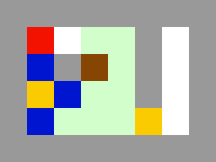

# About the Game
In the game, you are a red square and have to get the box (brown) to the lower right corner. Obstacles include falling stones (blue), walls (gray), and a lock (yellow, right) that can be unlocked with the key (yellow, left). You can push one stone or box at a time, and only if it is not falling. The flux (greenish) holds up boxes and stones but can be 'eaten' by the player. 

